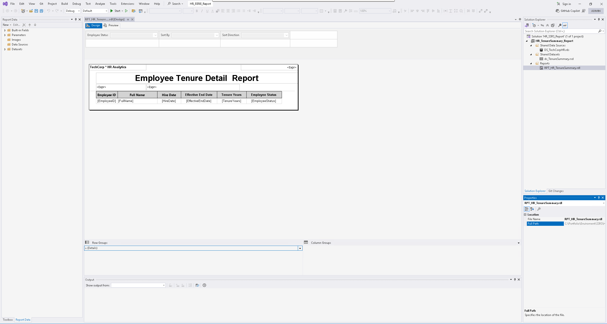

# SSRS HR Analytics Reports

This folder contains SQL Server Reporting Services (SSRS) report files and supporting assets for the TechCorp HR Analytics Platform.  
These reports are powered by the HR Analytics SQL Server database and stored procedures developed for employee headcount, tenure, and retention analysis.

---

## 📊 Employee Tenure Detail Report

**Report File:** `RPT_HR_TenureSummary.rdl`  
**Preview:**  

### 🧩 Design View (Report Layout)
This screenshot shows the report in Visual Studio Design Mode, including the tablix, parameters, and layout structure used to build the report.

---

### ✔️ Purpose
The Employee Tenure Detail Report provides HR and leadership with a clear view of:
- Employee tenure (in years)
- Hire and termination dates
- Employment status (Active vs. Terminated)
- Sorting options for tenure, hire date, and name

This report supports workforce planning, headcount tracking, and historical trend analysis.

---

## 🛠 Data Source

This report is powered by the stored procedure:

`HR.GetTenureMetricsSummary`

The procedure calculates:
- Tenure in years (2-decimal precision)  
- Employee status  
- Effective end dates for active and terminated employees  

All SQL logic is included in the `/SQL/StoredProcedures/` directory of this repository.

---

## 🧱 Report Features
- Filter by employee status  
- Sort by multiple fields  
- Clean enterprise-style layout  
- Export to PDF, Excel, and CSV  
- Built and deployed using SSRS 2022  

---

## 📂 Files in This Folder

This folder includes:

- **RPT_HR_TenureSummary.rdl** — the SSRS report  
- **EmployeeTenureReport.png** — screenshot/preview  
- **EmployeeTenureReport_DesignView.png** — design layout screenshot  
- **README.md** — documentation  

---

## ✨ Created By
**Rhondal S.**  
BI Developer • SQL Server • SSRS • Power BI
